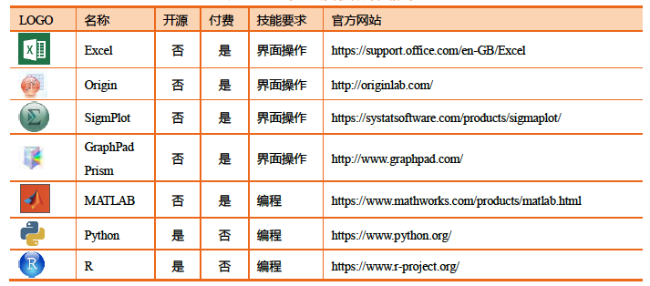
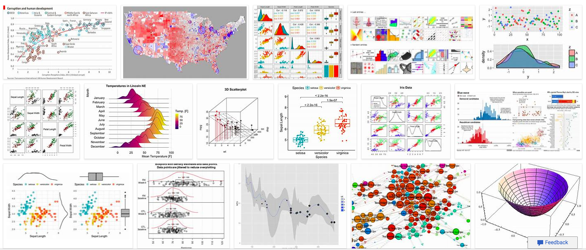
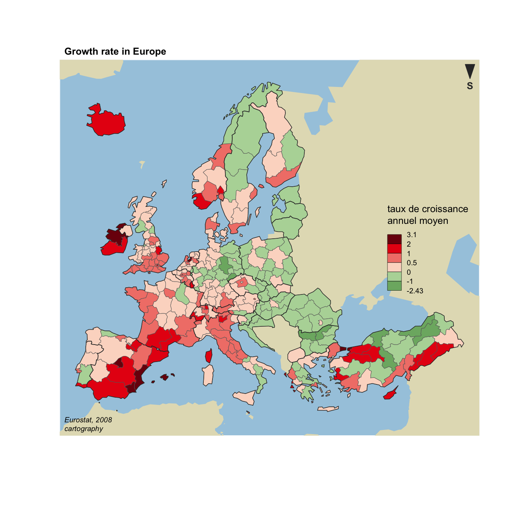
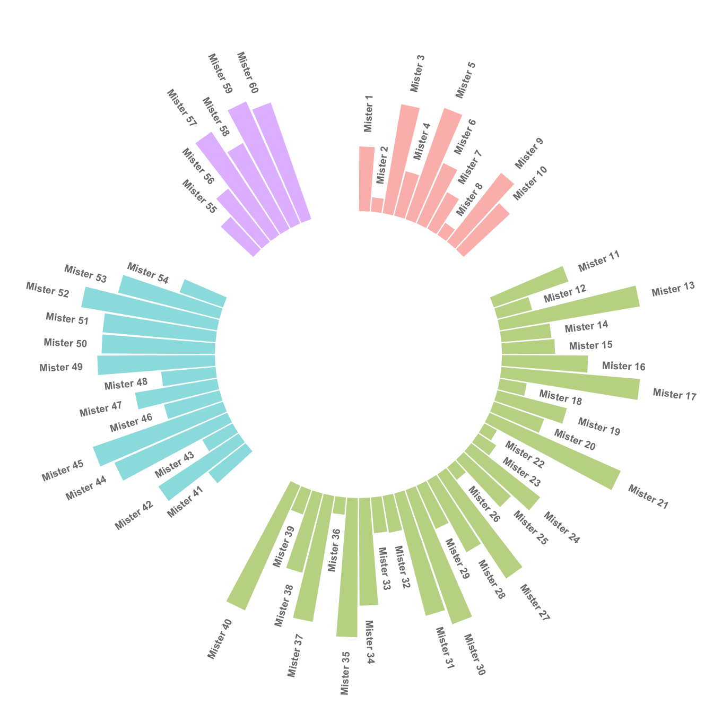
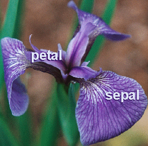
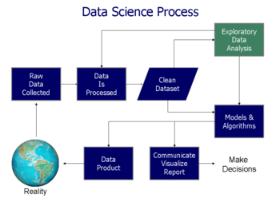

```{r setup, include=FALSE}
options(htmltools.dir.version = FALSE)
library(icon)
library(DT)
library(knitr)
library(tibble)
library(ggplot2)
library(plotly)
```

```{r xaringan-themer, include = FALSE}
library(xaringanthemer)
duo_accent(primary_color = "#006747", 
           secondary_color = "#CFC493",
           header_h1_font_size = '40px',
           header_h2_font_size = '30px',
           header_h3_font_size = '20px',
           title_slide_background_image ='数据动态.gif')
```

# 为何学数据可视化？


---
# 图表的作用
.blockquote[
- 真实、准确、全面地展示数据；
- 以较小的空间承载较多的信息；
- 揭示数据的本质、关系、规律。]

--
-
-

.content-box-yellow[可视化的终极目标是洞悉蕴含在数据中的现象和规律。

这包括多重含义：发现、决策、解释、分析、探索和学习.

正所谓：“一图胜千言”
]


---
#  Data Scientist The Sexy Job

```{r echo=FALSE, fig.align="center", out.width = '75%'}
knitr::include_graphics("HBR201210.png")
```

- See also an old article by NYT (2009): [For Today’s Graduate, Just One Word: Statistics](https://www.nytimes.com/2009/08/06/technology/06stats.html)

- And another famous McKinseay 2011 Report: 
[Big data: The next frontier for innovation, competition, and productivity](https://www.mckinsey.com/business-functions/digital-mckinsey/our-insights/big-data-the-next-frontier-for-innovation)


---
# 为何采用R做数据分析？


## `r icon::fa("bell")` R是什么？

## `r icon::fa("paw")` R能做什么？

.content-box-red[小调查]
.blockquote[
- 1.有处理过数据吗？量比较大，内容比较复杂那种？
- 2.你们平时用什么软件处理数据？
]
---
# 绘图软件比较
```{r echo=FALSE, fig.align="center", out.width = '100%'}

```

---
# R是什么？

## R is a language and environment for statistical computing and graphics.It includes

- an effective data handling and storage facility,
- a suite of operators for calculations on arrays, in particular matrices,
- a large, coherent, integrated collection of intermediate tools for data analysis,graphical facilities for data analysis and display either on-screen or on hardcopy, and
- a well-developed, simple and effective programming language which includes conditionals, loops, user-defined recursive functions and input and output facilities.

.blockquote[The term “environment” is intended to characterize it as a fully planned and coherent system, rather than an incremental accretion of very specific and inflexible tools, as is frequently the case with other data analysis software.]

---
# Rstudio IDE
```{r echo=FALSE, fig.align="center", out.width = '75%'}
knitr::include_graphics("rstudio.png")
```

---
# R能做什么？
--

## .red[这个问题问得好？`r fa('trophy')`]

--
## 答案是：

--
.columns-2[
.content-box-green[在数据分析领域，无所不能
]
.content-box-green[就算现在不能，以后也一定能
]
]


---
# 用R绘制的图形

```{r echo=FALSE, fig.align="center", out.width = '140%'}

```

---
# 用R绘制的图形

```{r echo=FALSE, fig.align="center", out.height='75%'}
knitr::include_graphics("271-ggplot2-animated-gif-chart-with-gganimate1.gif")
```
---
# 用R绘制的图形

```{r echo=FALSE, fig.align="center",out.width='75%'}

```

---
# 用R绘制的图形

```{r echo=FALSE, fig.align="center",out.width='75%'}

```
---
# 用R绘制的图形

```{r echo=FALSE, message=FALSE, warning=FALSE}
demog <- tibble(
  sex = rep(c("male", "female"), each = 500),
  height = c(rnorm(500, 70, 4), rnorm(500, 65, 3.5)),
  age = rpois(1000, 3) + 20
)

demog_plot <- ggplot(demog, aes(age, height, fill=sex)) +
  geom_point(position = position_jitter(width= 0.2, height = 0), size = 2)

ggplotly(demog_plot)
```


---
# 各种图形
```{r echo=FALSE, fig.align="center",out.width='90%'}
include_graphics("charttype.png")
```
---
# R 代码

```{r comment='#'}
#做个计算题
5+5+7+9+10

# 生成十个数字
rnorm(10,mean = 0,sd = 1)
```
--

```{r comment='#'}
# 处理文字
dojutsu = c('地爆天星', '天照', '加具土命', '神威', '須佐能乎', '無限月読')
grep('天', dojutsu, value = TRUE)
```

---

# R 基本绘图
.pull-left[
```{r}
plot(cars)
```

]
.pull-right[

```{r echo=FALSE,fig.align='right',fig.width=4}

```
]

---

# R 绘图
```{r mtcars, echo=FALSE, fig.height=6, message=FALSE, warning=FALSE, dev='svg'}
attach(mtcars)
par(mfrow=c(2,2))
plot(wt,mpg, main="Scatterplot of wt vs. mpg")
plot(wt,disp, main="Scatterplot of wt vs disp")
hist(wt, main="Histogram of wt")
boxplot(wt, main="Boxplot of wt")
detach(mtcars)
```

---
# Iris Data Set（鸢尾属植物数据集）
Iris Data Set（鸢尾属植物数据集）首次出现在著名的英国统计学家和生物学家Ronald Fisher 1936年的论文《The use of multiple measurements in taxonomic problems》。

```{r echo=FALSE, fig.align="center",out.width='45%'}

```

---
# Iris Data Set（鸢尾属植物数据集）

在这个数据集中，包括了三类不同的鸢尾属植物：.red[Iris Setosa，Iris Versicolour，Iris Virginica]。每类收集了50个样本，因此这个数据集一共包含了150个样本。

该数据集测量了所有150个样本的4个特征，分别是：
.blockquote[
- sepal length（花萼长度）
- sepal width（花萼宽度）
- petal length（花瓣长度）
- petal width（花瓣宽度）
]
以上四个特征的单位都是厘米（cm）。
通常使用𝑚表示样本量的大小，𝑛表示每个样本所具有的特征数。因此在该数据集中，𝑚=150,𝑛=4
---
# 表格显示
```{r echo=FALSE, tidy=FALSE}
datatable(
  head(iris, 40),
  fillContainer = FALSE, options = list(pageLength = 6)
)
```
---
# 做个练习
三类不同的鸢尾属植物：
.red[- Iris Setosa
- Iris Versicolour
- Iris Virginica
]

4个特征：
.red[
- sepal length（花萼长度）
- sepal width（花萼宽度）
- petal length（花瓣长度）
- petal width（花瓣宽度）
]

.blockquote[问题：请按种类分别求各特征的均值]
---
# 让R来帮你完成
```{r echo=TRUE, message=FALSE, warning=FALSE}
library(dplyr)
datatable(iris %>% 
  group_by(Species) %>% 
  summarise_all(mean))
```
---
# 数据分析的基本流程
```{r echo=FALSE, fig.align="center",out.width='100%'}

```

---
class:center middle
background-image: url("titleimage.jpg")
background-size: cover


# .white[谢谢聆听!]

## .red[下次请带上电脑，我们一起感受R的乐趣！]

### .white[毛益民]
### .white[浙江工商大学公共管理学院]
