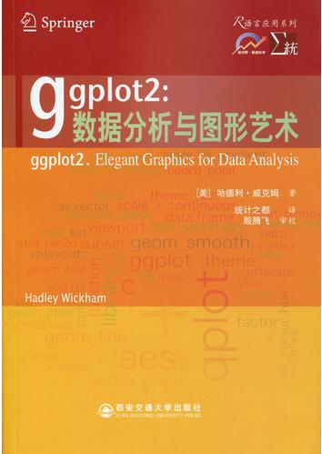
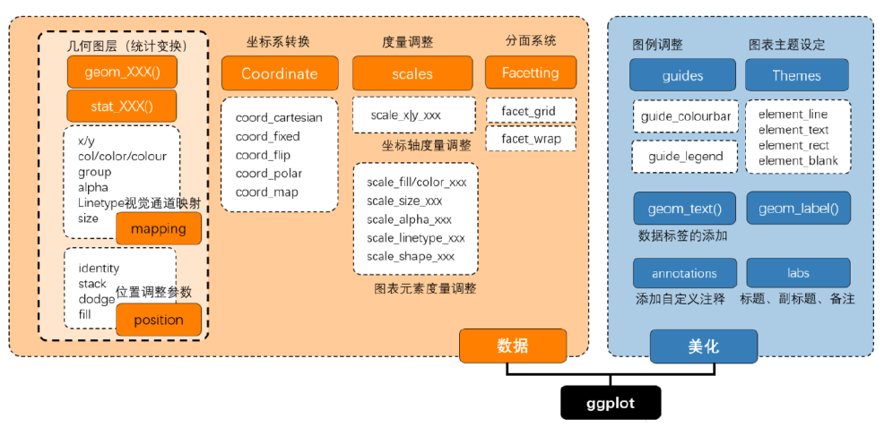
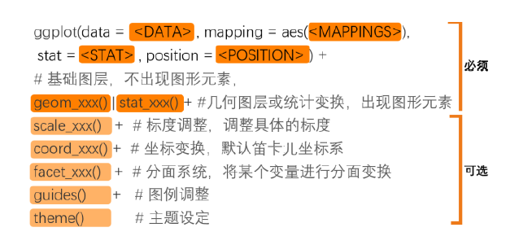
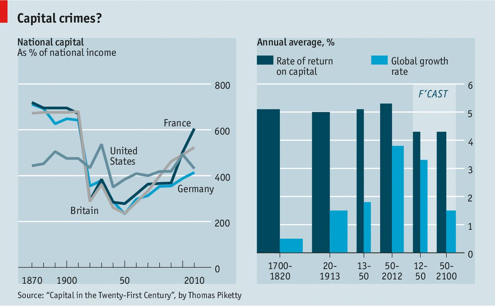
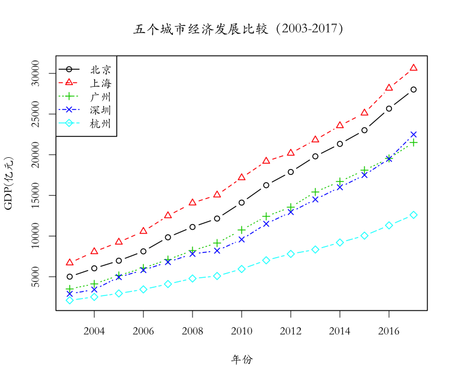

```{r setup, include=FALSE}
options(htmltools.dir.version = FALSE)
library(icon)
library(DT)
library(knitr)
library(tibble)
library(ggplot2)
library(plotly)
library(dplyr)
library(ggthemes)
```

```{r xaringan-themer, include = FALSE}
library(xaringanthemer)
duo_accent(primary_color = "#006747", 
           secondary_color = "#CFC493",
           header_h1_font_size = '40px',
           header_h2_font_size = '30px',
           header_h3_font_size = '20px',
           title_slide_background_image ='数据动态.gif')
```
# ggplot2是什么？

> ggplot2 是一个功能强大且灵活的R 包，由Hadley Wickham 编写，它可以生成优雅而实用的图形。ggplot2中的gg表示图形语法*（grammar of graphic）*，这是一个通过使用“语法”来绘图的图形概念。
因其功能强大，ggplot2是下载量最高的R包之一。

.pull-left[
```{r echo=FALSE,out.width="60%",fig.align='center'}

```
]

.pull-right[
```{r echo=FALSE,out.width="120%",fig.align='center'}

```
]
---
# ggplot2 图形语法

.content-box-green[
（1）采用图层的设计方式，有利于结构化思维实现数据可视化。有明确的起始（ggplot()开始）与终止，图层之间的叠加是靠“+”实现的，越往后，其图层越在上方。通常一条geom_xxx()函数
或stat_xxx函数可以绘制一个图层。
]

.content-box-red[
（2）将表征数据和图形细节分开，能快速将图形表现出来，使创造性的绘图更加容易实现。而且通过stat_xxx()函数将常见的统计变换融入绘图中。
]

.content-box-purple[
（3）图形美观，扩展包（extension package）丰富，有专门调整颜色（color）、字体（font）和主
题（theme）等辅助包。可以帮助用户快读定制个性化的图表。
]

*参考文献：张杰：《R语言 数据可视化之美》,电子工业出版社，2019年。*
---
# 语法框架
```{r echo=FALSE,fig.align='center'}

```

---
# 代码使用
```{r echo=FALSE,out.width="120%",fig.align='center'}

```
---
## 必需的图表输入信息：
.content-box-red[
（1）ggplot()：底层绘图函数。DATA 为数据集，主要是数据框（data.frame）格式的数据集；
MAPPINGS 变量的视觉通道映射，用来表示变量x 和y，还可以用来控制颜色（color）、大小（size）
或形状（shape）等视觉通道；STAT 表示统计变换，与stat_xxx相对应，默认为"identity"（无数据
变换）；POSITION 表示绘图数据系列的位置调整，默认为"identity"（无位置调整）。
]

.content-box-purple[
（2）geom_xxx() | stat_xxx()：几何图层或统计变换，比如常见的geom_point()（散点图）、
geom_bar()（柱形图）、geom_histogram()（统计直方图）、geom_ boxplot()（箱形图）、geom_line()（折线图）等。我们通常使用geom_xxx()函数就可以绘制大部分图表，有时候通过设定stat 参数可以先实现统计变换。
]

---
## 可选的图表输入信息：
>（1）scale_xxx()：度量调整，调整具体的度量，包括颜色（color）、大小（size）或形状（shape）
等，跟MAPPINGS 的映射变量相对应；

>（2）coord_xxx()：坐标变换，默认笛卡儿坐标系，还包括极坐标系、地理空间坐标系等；

>（3）facet_xxx()：分面系统，将某个变量进行分面变换，包括按行、列和网格等形式分面绘图。

>（4）guides()：图例调整，主要包括连续型和离散型两种类型的图例。

>（5）theme()：主题设定，主要用于调整图表的细节，包括图表背景颜色、网格线的间隔与颜色
等。

---
class: center
# 陷入思索

--
.content-box-red[老师，我有一个问题？
]

--
.content-box-green[嗯，什么问题？
]

--
.content-box-red[
我觉得这个ggplot2有点高级，但是——

```{r echo=FALSE,fig.align='center'}

```
]
---
# 经济学人图表

```{r echo=FALSE,fig.align='center'}

```
---
# 让我们做一张经济学人风格的图吧！
--
```{r echo=FALSE,out.height=500,out.width=500,fig.align='center'}
mycars <- cars %>% 
  mutate(type=rep(c("Domestic","Foreign"),25))
ggplot(mycars,aes(x=speed,y=dist,col=type,shape=type))+
  geom_point(size=4)+
  labs(title="The preformance comparison of two types of cars",
       subtitle = "Note that the data were recorded in the 1920s",
       caption = "Source: Ezekiel, M. (1930) Methods of Correlation Analysis. Wiley.",
       x= "Speed (mph)", y= "Stopping distance (ft)",
       shape="Type",col="Type")+
  theme_economist()

```

---
# 这是怎么做出来的呢？

>学会ggplot2,一切皆有可能。

```{r echo=FALSE,fig.align='center'}

```

---
# 一个简单的例子

.content-box-red[
## 数据集 cars 

[,1]	speed : numeric	Speed (mph)

[,2]	dist:	numeric	Stopping distance (ft)

Source: Ezekiel, M. (1930) Methods of Correlation Analysis. Wiley.
]

```{r}
mycars <- cars %>% 
  mutate(type=rep(c("Domestic","Foreign"),25)) #生成类别变量
head(mycars)
```

---
# ggplot 作图

```{r,out.height=400,fig.align='center'}
ggplot(mycars,aes(x=speed,y=dist))+
  geom_point()
```

---

# ggplot 作图

```{r,out.height=400,fig.align='center'}
ggplot(mycars,aes(x=speed,y=dist,col=type))+
  geom_point()
```

---
# ggplot 作图

```{r,out.height=400,fig.align='center'}
ggplot(mycars,aes(x=speed,y=dist,col=type,shape=type))+
  geom_point()
```

---
# ggplot 作图

```{r,out.height=400,fig.align='center'}
ggplot(mycars,aes(x=speed,y=dist,col=type,shape=type))+
  geom_point(size=3)+
  theme(text=element_text(size=15))
```
---
# ggplot 作图

```{r,out.height=400,fig.align='center'}
ggplot(mycars,aes(x=speed,y=dist,col=type,shape=type))+
  geom_point(size=3)+
   theme_economist()
```
---
# ggplot 作图

```{r,out.height=300,fig.align='center'}
ggplot(mycars,aes(x=speed,y=dist,col=type,shape=type))+
  geom_point(size=3)+
  labs(title="The preformance comparison of two types of cars",
       subtitle = "Note that the data were recorded in the 1920s",
       caption = "Source: Ezekiel, M. (1930) Methods of Correlation Analysis. Wiley.",
       x= "Speed (mph)", y= "Stopping distance (ft)")+
   theme_economist()
```
---
# ggplot 作图

```{r,out.height=300,fig.align='center'}
ggplot(mycars,aes(x=speed,y=dist,col=type,shape=type))+
  geom_point(size=3)+
  labs(title="The preformance comparison of two types of cars",
       subtitle = "Note that the data were recorded in the 1920s",
       caption = "Source: Ezekiel, M. (1930) Methods of Correlation Analysis. Wiley.",
       x= "Speed (mph)", y= "Stopping distance (ft)")+
   theme_economist_white()
```
---
# 练习

> 请利用ggplot2绘制如下图形：

> 1. 探索2016年全球各国（或地区）发展水平与腐败程度之间的关系

> 2. 点击右侧绿底英文下载数据 [.content-box-green[hdi vs cpi]](/datavis/data/hdi-cpi.csv)

> 3. 绘图风格参照《经济学人》杂志。

> 

## 
.content-box-green[

绘图完成后，感受一下基础绘图plot函数和ggplot2的功能差异。
]
---
# 其它图形的绘制
## 先载入一份关于教师薪酬的数据
```{r message=FALSE}
library(car)
data("Salaries")
head(Salaries)
```
---
# 密度图

```{r,out.height=400,fig.align='center'}
ggplot(Salaries,aes(x=salary))+
  geom_density()
```

---
# 密度图

```{r,out.height=400,out.width=600,fig.align='center'}
ggplot(Salaries,aes(x=salary,fill=rank))+ # 分组填充颜色
  geom_density()
```
---
# 密度图

```{r,out.height=400,out.width=600,fig.align='center'}
ggplot(Salaries,aes(x=salary,fill=rank))+
  geom_density(alpha=0.3) ## 设置透明度
```
---
#条形图

```{r,out.height=400,fig.align='center'}
ggplot(Salaries,aes(x=rank,fill=sex))+
  geom_bar(position = "stack")+ 
  theme_classic()
```
---
#条形图

```{r,out.height=400,fig.align='center'}
ggplot(Salaries,aes(x=rank,fill=sex))+
  geom_bar(position = "dodge")+
  theme_classic()
```
---
#条形图

```{r,out.height=400,fig.align='center'}
ggplot(Salaries,aes(x=rank,fill=sex))+
  geom_bar(position = "fill")+
  labs(y="proportion")
```
---
#条形图(经济学人风格)

```{r echo=FALSE, message=FALSE, warning=FALSE,fig.align='center'}
ggplot(Salaries,aes(x=rank,fill=sex))+
  geom_bar(position = "dodge")+
  labs(title = "The number of peeple in different rank of teaching",
       subtitle = "The 2008-09 nine-month academic salary in a college in the U.S.",
       x="",
       caption = "Fox J. and Weisberg, S. (2011) An R Companion to Applied Regression, Second Edition Sage.")+
  theme_economist()+
  scale_fill_manual(values = c("#6794a7","#014d64"))

```
---
# 线图:先看数据
```{r message=FALSE}
head(economics,5)
head(economics_long,5)
```

---
#绘图：单变量
```{r}
ggplot(economics, aes(date, unemploy)) + geom_line()
```

---
# 绘图：多个变量
```{r,fig.align='center'}
ggplot(economics_long, aes(date, value01, colour = variable)) +
  geom_line()
```

---
#练习

> 请绘制北上广深杭五个城市2003-2017年GDP的变化轨迹

> [数据citydata, 点击下载](/datavis/data/citydata.xls)

--
```{r echo=FALSE,out.height=300,out.width=300}

```
---
# 把柱形图和线图结合一下
```{r,fig.align='center',out.width=500,out.height=350}
library(RColorBrewer)
ggplot(economics,aes(x=date,y=unemploy))+
  geom_bar(aes(color=unemploy),stat="identity")+geom_line()+
  scale_color_gradientn(colors = brewer.pal(9,"Reds"))
```


---
# 点图
```{r,out.height=400,fig.align='center'}
df <- mtcars %>% mutate(car=factor(row.names(mtcars)))
ggplot(df,aes(car,mpg))+
  geom_point(shape=21,size=3)
```

---
# 克利夫兰点图
```{r echo=FALSE,fig.align='center'}
df <- mtcars %>% mutate(car=row.names(mtcars))
order <- sort(df$mpg,index.return=T,decreasing = F)
df$car_fator <- factor(df$car,levels = df$car[order$ix])
ggplot(df,aes(mpg,car_fator))+
  geom_point(shape=21,size=3,color="black",fill="red")
```

---
# 克利夫兰点图的代码

```{}
df <- mtcars %>% mutate(car=row.names(mtcars))

order <- sort(df$mpg,index.return=T,decreasing = F)

df$car_fator <- factor(df$car,levels = df$car[order$ix])

ggplot(df,aes(mpg,car_fator))+

  geom_point(shape=21,size=3,
             color="black",fill="red")
```

---
class:center middle
background-image: url("titleimage.jpg")
background-size: cover# .white[谢谢!]

## .red[勤加练习，方能提高绘图效率！]

### .white[毛益民]
### .white[浙江工商大学公共管理学院]