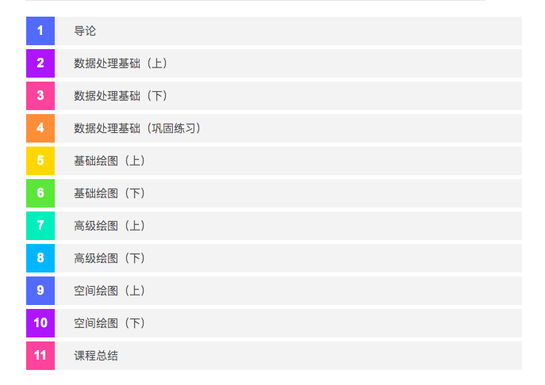
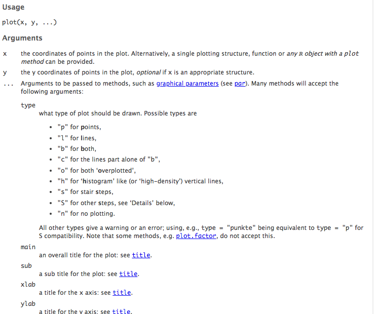
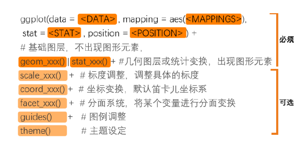

```{r setup, include=FALSE}
options(htmltools.dir.version = FALSE)
library(DT)
library(knitr)
library(tibble)
library(plyr)
library(dplyr)
library(ggplot2)
library(maptools)
library(maps)
library(RColorBrewer)
library(ggthemes)
```

# 课程总结
```{r echo=FALSE}

```

---
# 数据处理基础

重要工具包：dplyr, tidyr

关键函数：

 > select 选择
 
 > filter 筛选
 
 > mutate 生成新变量
 
 > arrange 排序
 
 > gather & spread 数据长短变换
 
---

其它很有用的函数：

> ifelse 如果...就...

> sort 对向量进行排序，同时生成索引

> merge 合并数据

> for 可以用来进行循环操作

---
# 基础绘图 plot

```{r echo=FALSE, out.width="70%"}

```


---
# 高级绘图 ggplot

```{r echo=FALSE}

```

---
# 空间绘图

```{r echo=TRUE, message=FALSE, warning=FALSE,fig.height=6, fig.width=10}
#大家可以采用sf包来读取和绘制地图，更加方便
library(sf)
nc = st_read(system.file("shape/nc.shp", package="sf"), 
             quiet = TRUE) # 这是在读取sf包自带的一份shp文件
ggplot(nc) + geom_sf()

```
---
# 看一下数据结构

```{r}
class(nc)
head(nc,3)
```

---
```{r echo=TRUE, fig.height=6, fig.width=10, message=FALSE, warning=FALSE}
# 采用geom_sf来绘制
library(ggplot2)
ggplot(nc) + geom_sf(aes(fill = SID79))
```

---
# 学无止境，常学常新

这只是一个开始，还有更多更有趣的东西等待你去发掘...

.pull-left[
```{r echo=FALSE,out.width="75%"}
include_graphics("土拨鼠.gif")
```

```{r echo=FALSE,out.width="75%"}
include_graphics("土拨鼠.gif")
```
]

.pull-right[
```{r echo=FALSE,out.width="75%"}
include_graphics("土拨鼠.gif")
```

```{r echo=FALSE,out.width="75%"}
include_graphics("土拨鼠.gif")
```
]

---
class:center middle
background-image: url("titleimage.jpg")
background-size: cover

# .white[谢谢!]
### .white[毛益民]
### .white[浙江工商大学公共管理学院]